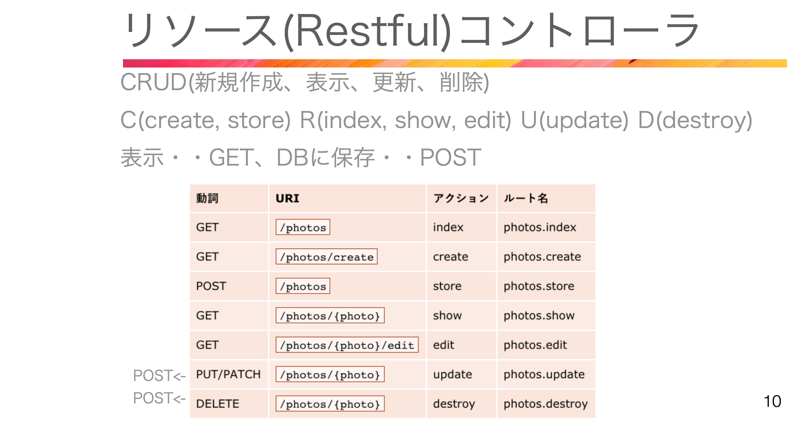

# 62. Edit 編集


ルート情報確認コマンド  
php artisan route:list | grep admin.  
Controler側  
$owner = Owner:findOrFail($id); //idなければ404画面  
View側/edit  
{{ $owner->name}}  

View側/index 名前付きルート 第2引数にidを指定  
route(‘admin.owners.edit’, [ ‘owner’ => $owner->id ]);  

App/Controllers/Admin/OwnerController.php
```php
public function index()
    {
        // idを追加
        $owners = Owner::select('id', 'name', 'email', 'created_at')->get();
        return view('admin.owners.index', compact('owners'));
    }

public function edit(string $id)
    {
        $owner = Owner::findOrFail($id);
        // dd($owner);
        return view('admin.owners.edit', compact('owner'));
    }
```

resources/views/admin/owners/edit.blade.php
```php
<x-slot name="header">
    <h2>オーナー情報編集</h2>
</x-slot>
<h1>オーナー情報編集</h1>
// updateで更新して何番目の情報かを入れる必要があるので[]
<form method="post" action="{{ route('admin.owners.update', ['owner' => $owner->id])}}">
    @method('PUT')
    @csrf
    <label>オーナー名</label>
    <input type="text" id="name" name="name" value="{{ $owner->name }}">
    <x-input-error :messages="$errors->get('name')" class="mt-2" />


    <div class="relative">
        <label>メールアドレス</label>
        <input type="email" id="email" name="email"  value="{{ $owner->email }}">
        <x-input-error :messages="$errors->get('email')" class="mt-2" />
    </div>

    <div class="relative">
        <label>パスワード</label>
        <input type="password" id="password" name="password">
        <x-input-error :messages="$errors->get('password')" class="mt-2" />
    </div>

    <div class="relative">
        <label>パスワード確認</label>
        <input type="password" id="password_confirmation" name="password_confirmation">
        <x-input-error :messages="$errors->get('password_confirmation')" class="mt-2" />
    </div>
    <div class="p-2 w-full flex justify-around mt-4">
    <button type="button" onclick="location.href='{{ route('admin.owners.index')}}'">戻る</button>
    <button type="submit">更新する</button>                        
</form>
```

resources/views/admin/owners/index.blade.php
```php
<x-slot name="header">
    <h2>オーナー一覧</h2>
</x-slot>
<button onclick="location.href='{{ route('admin.owners.create')}}'">新規登録する</button>                        
<table class="table-auto w-full text-left whitespace-no-wrap">
    <thead>
        <tr>
        <th class="px-4 py-3">名前</th>
        <th class="px-4 py-3">メールアドレス</th>
        <th class="px-4 py-3">作成日</th>
        <th class="px-4 py-3"></th>
        </tr>
    </thead>
    <tbody>
        @foreach ($owners as $owner)
        <tr>
            <td class="px-4 py-3">{{ $owner->name }}</td>
            <td class="px-4 py-3">{{ $owner->email }}</td>
            <td class="px-4 py-3">{{ $owner->created_at->diffForHumans() }}</td>
            <td class="px-4 py-3">
                //名前付きルート 第２引数にidを指定 
                <button onclick="location.href=
                '{{ route('admin.owners.edit', ['owner' => $owner->id ])}}'">編集</button>                        
            </td>
        </tr>
        @endforeach
    </tbody>
</table>
```

<br>

# 63. Update 更新

Controler側  
```php
$owner = Owner:findOrFail($id);  
$owner->name = $request->name;  
$owner->email = $request->email;  
$owner->password = Hash:make($request->password);  
$owner->save();  
return redirect()->route()->with();  
```

View側(擬似フォームメソッド)
@method(‘put’)  

App/Controllers/Admin/OwnerController.php  
```php
public function update(Request $request, $id)
    {
        $owner = Owner::findOrFail($id);
        $owner->name = $request->name;
        $owner->email = $request->email;
        $owner->password = Hash::make($request->password);
        $owner->save();

        return redirect()
        ->route('admin.owners.index')
        ->with('message', 'オーナー情報を更新しました。');
    }
```

resources/views/admin/owners/edit.blade.php
```php
@method('PUT')
```