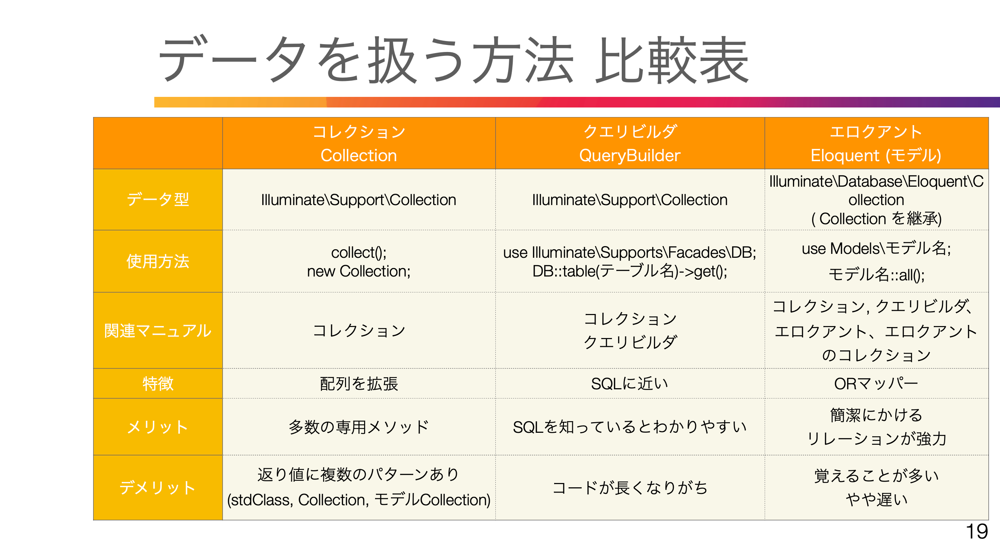
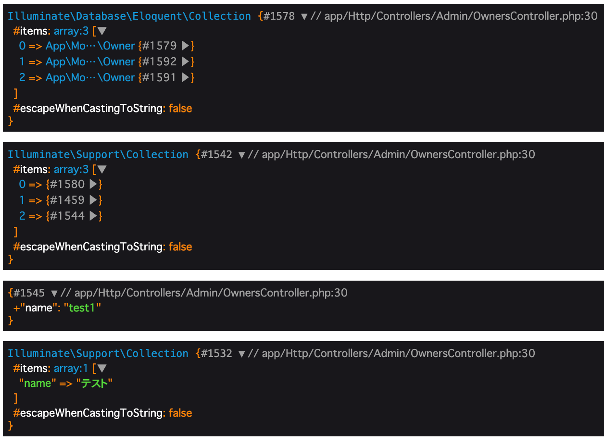

# 53. シーダー

### シーダー作成
database/seeders 直下に生成  
php artisan make:seeder AdminSeeder  
php artisan make:seeder OwnerSeeder  

database/seeders/AdminSeeder.php  
```php
namespace Database\Seeders;

use Illuminate\Database\Console\Seeds\WithoutModelEvents;
use Illuminate\Database\Seeder;
use Illuminate\Support\Facades\DB;
use Illuminate\Support\Facades\Hash;

class AdminSeeder extends Seeder
{
    public function run(): void
    {
        // DBファサードのinsertで連想配列にて追加  
        // パスワードがあればHashファサードも使う  
        DB::table('admins')->insert([
            'name' => 'test',
            'email' => 'test@test.com.com',
            'password' => Hash::make('password123'),
            'created_at' => '2024/01/01 11:11:11'
        ]);
    }
}
```

### 追加のシーダ呼び出し
database/seeders/DatabaseSeeder.php
```php
namespace Database\Seeders;

// use Illuminate\Database\Console\Seeds\WithoutModelEvents;
use Illuminate\Database\Seeder;

class DatabaseSeeder extends Seeder
{
    /**
     * Seed the application's database.
     */
    public function run(): void
    {
        $this->call([
            AdminSeeder::class,
            OwnerSeeder::class,
        ]);
    }
}
```

### シーダの実行
php artisan migrate:refresh --seed  
down()を実行後up()を実行  
php artisan migrate:fresh --seed  
全テーブル削除してup()を実行  

<br>

# 54. データを扱う方法の比較



App/Http/Controllers/Admin/OwnersController.php
```php
namespace App\Http\Controllers\Admin;

use App\Http\Controllers\Controller;
use Illuminate\Http\Request;
use App\Models\Owner; //Eloquent
use Illuminate\Support\Facades\DB; //QueryBuilder 

class OwnersController extends Controller
{
    public function __construct()
    {
        $this->middleware('auth:admin');
    }

    public function index()
    {
        $e_all = Owner::all(); //Eloquent
        $q_get = DB::table('owners')->select('name')->get(); //QueryBuilder 
        $q_first = DB::table('owners')->select('name')->first();

        $c_test = collect([
            'name' => 'テスト'
        ]); //Collection

        dd($e_all, $q_get, $q_first,  $c_test);
    }
}
```



<br>

# 55. Carbon 日付ライブラリ1

PHPのDateTimeクラスを拡張した日付ライブラリ,Laravelに標準搭載  
公式サイト  
https://carbon.nesbot.com/  
個人ブログ  
https://coinbaby8.com/carbon-laravel.html  

エロクアントでデータ取得した際にtimestampはCarbonインスタンスになっている    
$eloquents->created_at

->diffForHumans()のCarbonメソッドで繋げることができる  

クエリビルダでCarbonを使うならCarbonインスタンスになっていないので  
parseする必要がある  
Carbon\Carbon:parse($query->created_at)->diffForHumans()

App/Http/Controllers/Admin/OwnersController.php  
```php
use Carbon\Carbon;

class OwnersController extends Controller
{
    public function __construct()
    {
        $this->middleware('auth:admin');
    }
   
    public function index()
    {
        $date_now = Carbon::now();
        $date_parse = Carbon::parse(now());
        echo $date_now->year;
        echo $date_parse;

        $e_all = Owner::all();
        $q_get = DB::table('owners')->select('name', 'created_at')->get();
        $q_first = DB::table('owners')->select('name')->first();

        $c_test = collect([
            'name' => 'テスト'
        ]);

        dd($e_all, $q_get, $q_first,  $c_test);
}
```

<br>

# 56. Carbon 2

```php
use Carbon\Carbon;

class OwnersController extends Controller
{
    public function __construct()
    {
        $this->middleware('auth:admin');
    }
   
    public function index()
    {
        $date_now = Carbon::now();
        $date_parse = Carbon::parse(now());
        echo $date_now->year;
        echo $date_parse;

        $e_all = Owner::all();
        $q_get = DB::table('owners')->select('name', 'created_at')->get();

        return view('admin.owners.index', compact('e_all', 'q_get'));
    }
}
```
resources/views/admin/owners/index.blade.php
```php
<div class="p-6 text-gray-900">
    エロクアント
    @foreach ($e_all as $e_owner)
        {{ $e_owner->name }}
        {{ $e_owner->created_at->diffForHumans() }}
    @endforeach
    <br>
    クエリビルダ
    @foreach ($q_get as $q_owner)
        {{ $q_owner->name }}
        {{ Carbon\Carbon::parse($q_owner->created_at)->diffForHumans() }}
    @endforeach
</div>
```


