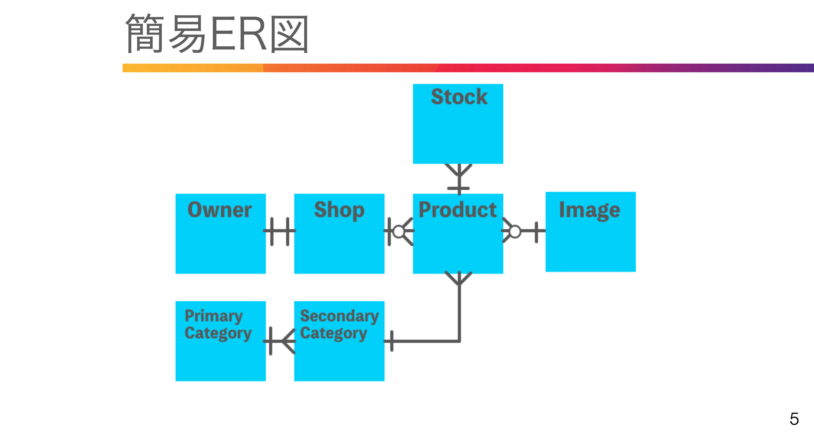

# 83. フォームリクエスト


### 目的1：　バリデーションを作りたい
### 目的２：　カスタムリクエストを使って同じ処理をまとめたい

リクエストクラスを拡張してエラーメッセージを書く  
php artisan make:request UploadImageRequest  
App\Http\Requests\UploadImageRequest.php  


app/Http/Requests/UploadImageRequest.php
```php
public function rules()
    {
        return [
            'image'=>'image|mimes:jpg,jpeg,png|max:2048',
        ];
    }

    public function messages()
    {
    return [
      'image' => '指定されたファイルが画像ではありません。',
      'mimes' => '指定された拡張子（jpg/jpeg/png）ではありません。',
      'max' => 'ファイルサイズは2MB以内にしてください。',
      ];
    }
```

app/Http/Controllers/Owner/ShopController.php
```php
use App\Http\Requests\UploadImageRequest;

public update(UploadImageRequest $request, $id)
{
}
```

resources/views/owner/shops/edit.blade.php
```php
<x-input-error :messages="$errors->get('image')" class="mt-2" />

```

<br>

# 84. サービスへの切り離し

### 重複を防ぎ、ファットコントローラを防ぎたい

resources/views/owner/shops/edit.blade.php
```php
namespace App\Services;

use Illuminate\Support\Facades\Storage;
use InterventionImage;


class ImageService
{
  public static function upload($imageFile, $folderName){

    $fileName = uniqid(rand().'_');
    $extension = $imageFile->extension();
    $fileNameToStore = $fileName. '.' . $extension;
    $resizedImage = InterventionImage::make($imageFile)->resize(1920, 1080)->encode();
    Storage::put('public/' . $folderName . '/' . $fileNameToStore, $resizedImage );
    
    // ファイル名を返してデータベースに保存
    return $fileNameToStore;
  }
}
```

app/Http/Controllers/Owner/ShopController.php
```php
use App\Services\ImageService;

public function update(UploadImageRequest $request, $id)
    {
        $imageFile = $request->image;
        if(!is_null($imageFile) && $imageFile->isValid() ){
            $fileNameToStore = ImageService::upload($imageFile, 'shops');
            }

        return redirect()->route('owner.shops.index');
    }
```
