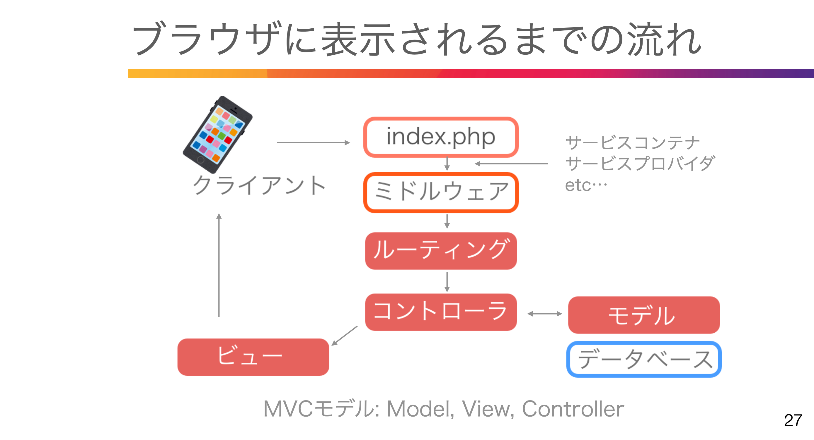
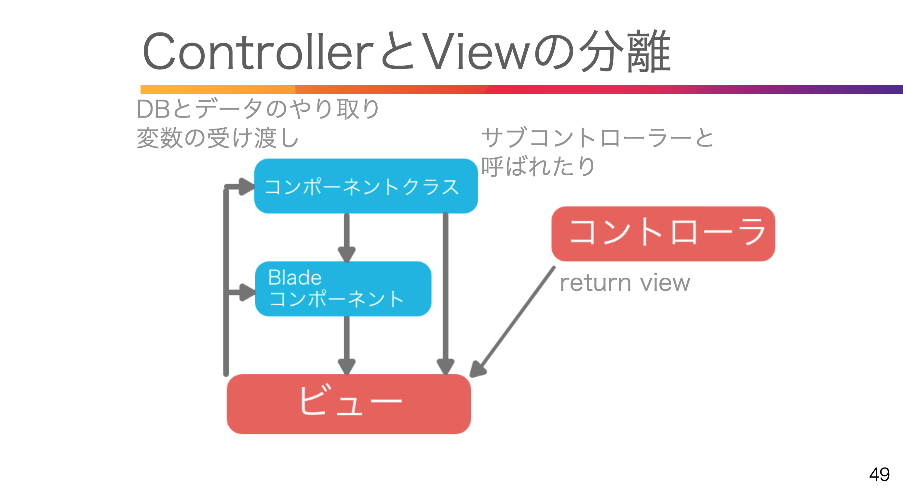
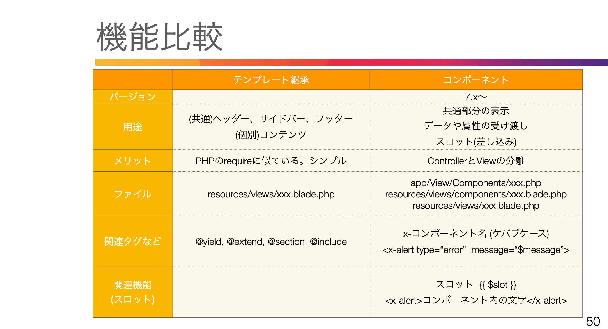

# 12 Laravel Breezeの紹介

ログイン、ユーザー登録、パスワードリセット、メール認証、 パスワード確認機能を追加

Control + C // 簡易サーバーの終了   

composer require laravel/breeze:^1.13 --dev  // インストール 

php artisan breeze:install  
<span style="color: red; ">→画面右上にlogin,registerが表示される</span>


    composer.json に tailwindcss,alpinejs が追記  
    App\Models\User.php 追記  
    Authenticatableクラスを継承して認証機能追加(Auth)  
    resources\css\app.css 追記 tailwind読み込む
    下記が追加される

npm install  

npm run dev // フロント側簡易サーバー(jsやcssをコンパイル)

<br>

# 15. 表示の流れ、ルーティング


ミドルウェアでログインしているかどうか認証


### ルートファイル
```php
use Illuminate\Support\Dacades\Route; //Routeを読み込む
use App\Http\Controllers\Auth\RegisteredUserController; //コントローラを読み込む

Route::get('/register', //Route::getかpost(url))
[RegisteredUserController::class,'create']) //[]でコントローラ名、メソッド名
->middleware('guest') //middleware guestだったら
->name('register'); //名前付きルート
```

マニュアル: 認証
->ルートの保護、リダイレクト、ガードの指定、ログイン回数制限

<br>

# 16. ルート->コントローラ->ビュー

```php
コントローラファイル群
app/Http/Controllers/Auth

authenticatedSession //認証セッション
confirmablePassword //パスワード確認
emailVerificationNotification //メール検証通知
emailVerificationPrompt //メール検証プロンプト
newPassword //新しいパスワード
passwordResetLink //パスワードセットリンク
registeredUser //ユーザー登録
verifyEmail //メール検証

ビューファイル群
Resources/views/auth

confirm-password //パスワード確認
forget-password //パスワード忘れ
login //ログイン
register //新規登録
reset-password //パスワードリセット
verify-email //メール検証
```
<br>

# 17. 日本語化対応

composer require  laravel-lang/publisher laravel-lang/lang --dev  

php artisan lang:add ja //langフォルダがない場合

マニュアルの言語ファイルをlang/ja/配下にそれぞれ配置する  

    lang/ja/auth.php, pagination.php, password.php, validation.php  
    validation.php の 'attributes' に追記 'attributes' => ['password' => 'パスワード']  
    ja.jsonファイルを作成 lang/ja.json { "Whoops! Something went wrong.":"何か問題が発生しました。" }


<br>

# 19. tailwindcss ver変更にあたって

ターミナルを複数開く  
ターミナル１：npm run watch
ターミナル２：php artisan serve
ターミナル３：Laravel各コマンド実行

<br>

# 20. Bladeコンポーネントの紹介

### ControllerとViewの分離



<br>

# 21. 準備(ルート→コントローラ→ビュー)

routes\web.php  

use App\Http\Controllers\Auth\ComponentTestController;


php artisan make:controller ComponentTestController  

```php
App\Http\Controllers\ComponentTestController.php  

class ComponentTestController extends Controller
{
    public function showComponent1(){
        return view('tests.component-test1');
    }
    public function showComponent2(){
        return view('tests.component-test2');
    }
}
```
