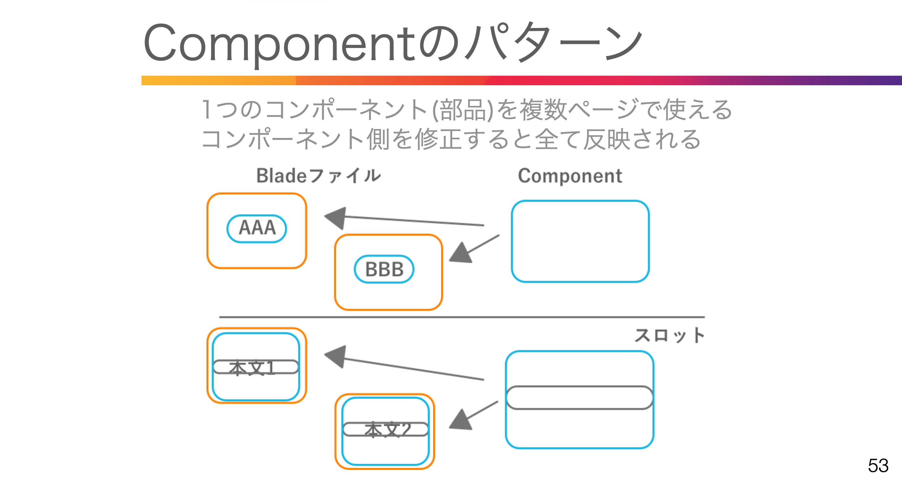
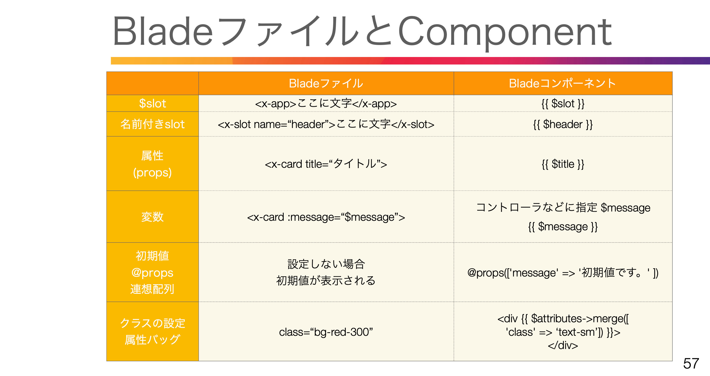
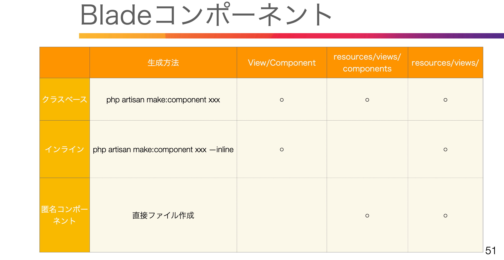
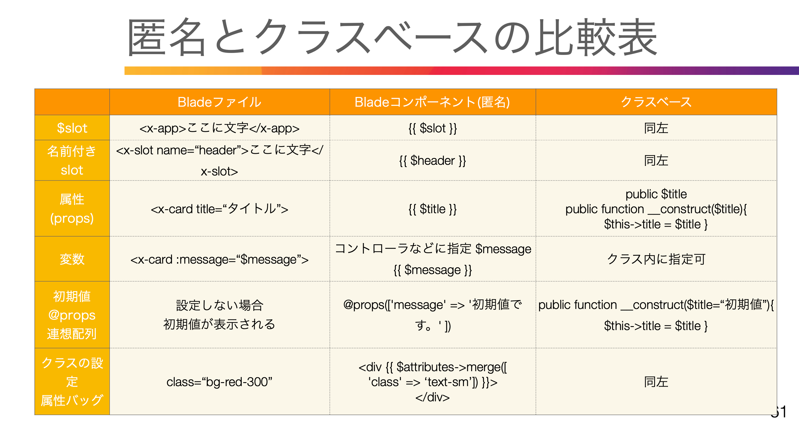

# 12 Laravel Breezeの紹介

ログイン、ユーザー登録、パスワードリセット、メール認証、 パスワード確認機能を追加

Control + C // 簡易サーバーの終了   

composer require laravel/breeze:^1.13 --dev  // インストール 

php artisan breeze:install  
<span style="color: red; ">→画面右上にlogin,registerが表示される</span>


    composer.json に tailwindcss,alpinejs が追記  
    App\Models\User.php 追記  
    Authenticatableクラスを継承して認証機能追加(Auth)  
    resources\css\app.css 追記 tailwind読み込む
    下記が追加される

npm install  

npm run dev // フロント側簡易サーバー(jsやcssをコンパイル)

<br>

# 15. 表示の流れ、ルーティング


ミドルウェアでログインしているかどうか認証


### ルートファイル
```php
use Illuminate\Support\Dacades\Route; //Routeを読み込む
use App\Http\Controllers\Auth\RegisteredUserController; //コントローラを読み込む

Route::get('/register', //Route::getかpost(url))
[RegisteredUserController::class,'create']) //[]でコントローラ名、メソッド名
->middleware('guest') //middleware guestだったら
->name('register'); //名前付きルート
```

マニュアル: 認証
->ルートの保護、リダイレクト、ガードの指定、ログイン回数制限

<br>

# 16. ルート->コントローラ->ビュー

```php
コントローラファイル群
app/Http/Controllers/Auth

authenticatedSession //認証セッション
confirmablePassword //パスワード確認
emailVerificationNotification //メール検証通知
emailVerificationPrompt //メール検証プロンプト
newPassword //新しいパスワード
passwordResetLink //パスワードセットリンク
registeredUser //ユーザー登録
verifyEmail //メール検証

ビューファイル群
Resources/views/auth

confirm-password //パスワード確認
forget-password //パスワード忘れ
login //ログイン
register //新規登録
reset-password //パスワードリセット
verify-email //メール検証
```
<br>

# 17. 日本語化対応

composer require  laravel-lang/publisher laravel-lang/lang --dev  

php artisan lang:add ja //langフォルダがない場合

マニュアルの言語ファイルをlang/ja/配下にそれぞれ配置する  

    lang/ja/auth.php, pagination.php, password.php, validation.php  
    validation.php の 'attributes' に追記 'attributes' => ['password' => 'パスワード']  
    ja.jsonファイルを作成 lang/ja.json { "Whoops! Something went wrong.":"何か問題が発生しました。" }


<br>

# 19. tailwindcss ver変更にあたって

ターミナルを複数開く  
ターミナル１：npm run watch
ターミナル２：php artisan serve
ターミナル３：Laravel各コマンド実行

<br>

# 20. Bladeコンポーネントの紹介

### ControllerとViewの分離


<br>

# 21. 準備(ルート→コントローラ→ビュー)

routes\web.php  

```php
use App\Http\Controllers\ComponentTestController;

Route::get('/component-test1', [ComponentTestController::class, 'showComponent1']);
Route::get('/component-test2', [ComponentTestController::class, 'showComponent2']);

```

php artisan make:controller ComponentTestController  

App/Http/Controllers/ComponentTestController.php  
```php
class ComponentTestController extends Controller
{
    public function showComponent1(){
        return view('tests.component-test1');
    }
    public function showComponent2(){
        return view('tests.component-test2');
    }
}
```
resources/views/tests/component-test1.blade.php
resources/views/tests/component-test2.blade.php

<br>

# 22. $slot



### Componentの書き方
resources/views/components フォルダ内に配置  
<x-コンポーネント名></x-コンポーネント名>  

フォルダで分けたい場合  
resources/views/components/tests フォルダの場合   
<x-tests.コンポーネント名></x-tests.>

```php
resources/views/tests/component-test1.blade.php　　
<x-tests.app>コンポーネントテスト１</x-tests.app>  

resources/views/components/tests/app.blade.php
<div>{{ $slot }}</div>
```

<br>

# 23. x-slot(名前付きスロット)

### Slot
Component側  
{{ $slot }}-> {{ マスタッシュ構文 }}  

Blade側  
<x-app>この文章が差し込まれる</x-app>

### 名前付きSlot
Component側  
{{ $header }}  

Blade側  
<x-slot name="header">この文章が差し込まれる</x-slot>

```php
resources/views/tests/component-test1.blade.php　　
<x-tests.app>
    <x-slot name="header">ヘッダー１</x-slot>
     コンポーネントテスト１
</x-tests.app>

resources/views/components/tests/app.blade.php
<header>{{ $header }}</header>
```

<br>

# 24. データの受け渡し方法(属性)


```php
resources/views/tests/component-test1.blade.php　
　
resources/views/components/tests/card.blade.php
<div class="border-2 shadow-md w-1/4 -p-2">
    <div>{{ $title }}</div>
    <div>画像</div>
    <div>{{ $content }}</div>
</div>
```
<br>

# 25. データの受け渡し方法(変数)

### コントローラなどから変数を渡す
コントローラ側  
$message = 'メッセージ';  
return view('ビューファイル', compact('message'));  

Blade側  
<x-card :message="$message" />  

```php
App/Http/Controllers/ComponentTestController.php  

class ComponentTestController extends Controller
{
    public function showComponent1(){
        $message = 'メッセージ';
        return view('tests.component-test1', compact('message'));
    }
}

resources/views/components/tests/card.blade.php

<div class="border-2 shadow-md w-1/4 -p-2">
    <div>{{ $title }}</div>
    <div>画像</div>
    <div>{{ $content }}</div>
    <div>{{ $message }}</div>
</div>

resources/views/tests/component-test1.blade.php　

<x-tests.app>
    <x-slot name="header">ヘッダー１</x-slot>
     コンポーネントテスト１
    <x-tests.card title="タイトル" content="本文" :message="$message"/>
</x-tests.app>
```
<br>

# 26. 初期値の設定方法(@props)

```php
resources/views/tests/component-test1.blade.php　

<x-tests.app>
    <x-slot name="header">ヘッダー１</x-slot>
     コンポーネントテスト１
    <x-tests.card title="タイトル" content="本文" :message="$message"/>
    <x-tests.card title="タイトル2" />
</x-tests.app>

resources/views/components/tests/card.blade.php

@props([
    'title',
    'message' => '初期値です。',
    'content' => '本文初期値です'
    ])

```

<br>

# 27. 属性バック($attribute)

```php
resources/views/tests/component-test1.blade.php　

<x-tests.app>
    <x-slot name="header">ヘッダー１</x-slot>
     コンポーネントテスト１
    <x-tests.card title="タイトル" content="本文" :message="$message"/>
    <x-tests.card title="タイトル2" />
    <x-tests.card title="CSSを変更したい" class="bg-red-300" />
</x-tests.app>

resources/views/components/tests/card.blade.php

<div {{ $attributes->merge([
    'class' => 'border-2 shadow-md w-1/4 p-2'
    ]) }} >
    <div>{{ $title }}</div>
    <div>画像</div>
    <div>{{ $content }}</div>
    <div>{{ $message }}</div>
</div>

```

<br>

# 28. クラスベースのコンポーネント



### クラスベースのコンポーネント
App/View/Components内のクラスを指定する  

クラス名・・TestClassBase (パスカルケース)  
Blade内・・x-test-class-base (ケバブケース)  

コンポーネントクラス内で  
public function render(){
    return view('bladeコンポーネント名')
}

php artisan make:component TestClassBase

```php
resources/views/tests/component-test2.blade.php　
<<x-tests.app>
    <x-slot name="header">ヘッダー１</x-slot>
     コンポーネントテスト１
    
    <x-test-class-base />
</x-tests.app>

App/View/components/TestClassBase.php
class TestClassBase extends Component
{
   
    public function render(): View|Closure|string
    {
        return view('components.tests.test-class-base-component');
    }
}

resources/views/components/tests/test-class-base-component.blade.php  
<div>クラスベースのコンポーネント</div>  

```
<br>

# 29. クラスベースで属性・初期値を設定する

```php
resources/views/components/tests/test-class-base-component.blade.php  
<div>
    クラスベースのコンポーネント
    <div>{{ $classBaseMessage }}</div>
    <div>{{ $defaultMessage }}</div>
</div>

resources/views/tests/component-test2.blade.php　
<x-tests.app>
    <x-slot name="header">ヘッダー2</x-slot>
     コンポーネントテスト2
    <x-test-class-base classBaseMessage="メッセージです" />
    <div class="mb-4"></div>
    <x-test-class-base classBaseMessage="メッセージです" defaultMessage="初期値から変更" />
</x-tests.app>

App/View/components/TestClassBase.php  
class TestClassBase extends Component
{
    public $classBaseMessage;
    public $defaultMessage;

    public function __construct($classBaseMessage, $defaultMessage="初期値です")
    {
        $this->classBaseMessage = $classBaseMessage;
        $this->defaultMessage = $defaultMessage;
    }

    public function render(): View|Closure|string
    {
        return view('components.tests.test-class-base-component');
    }
}
```
