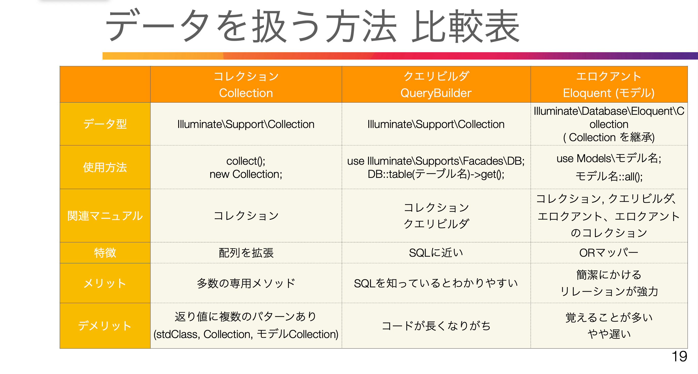

# 57. 一覧画面(tailblocks利用)
### 目的：　管理者の一覧画面を整えたい
resources/views/admin/owners/index.blade.php
```php
<table>
    <thead>
        <tr>
            <th >名前</th>
            <th>メールアドレス</th>
            <th>作成日</th>
            <th></th>
        </tr>
    </thead>
    <tbody>
        @foreach ($owners as $owner)
        <tr>
            <td>{{ $owner->name }}</td>
            <td>{{ $owner->email }}</td>
            <td>1{{ $owner->created_at->diffForHumans() }}</td>
            <td>
            <input name="plan" type="radio">
            </td>
        </tr>
        @endforeach
    </tbody>
</table>
```
<br>

# 5８. Create 新規作成
### 目的：　登録画面を作成、編集
app/Http/Controllers/Admin/OwnersController.php
```php
public function create()
    {
        return view('admin.owners.create');
    }
```

resources/views/admin/owners/create.blade.php
```php
<x-app-layout>
  <x-slot name="header">
      <h2 class="font-semibold text-xl text-gray-800 leading-tight">
          オーナー登録
      </h2>
  </x-slot>
  <div class="py-12">
      <div class="max-w-7xl mx-auto sm:px-6 lg:px-8">
          <div class="bg-white overflow-hidden shadow-sm sm:rounded-lg">
              <div class="p-6 bg-white border-b border-gray-200">
                <section class="text-gray-600 body-font relative">
                  <div class="container px-5 mx-auto">
                    <div class="flex flex-col text-center w-full mb-12">
                      <h1 class="sm:text-3xl text-2xl font-medium title-font mb-4 text-gray-900">オーナー登録</h1>
                    </div>
                    <div class="lg:w-1/2 md:w-2/3 mx-auto">
                        <div class="-m-2">
                            <div class="p-2 w-1/2 mx-auto">
                            <div class="relative">
                                <label for="name" class="leading-7 text-sm text-gray-600">オーナー名</label>
                                <input type="text" id="name" name="name" required class="w-full bg-gray-100 bg-opacity-50 rounded border border-gray-300 focus:border-indigo-500 focus:bg-white focus:ring-2 focus:ring-indigo-200 text-base outline-none text-gray-700 py-1 px-3 leading-8 transition-colors duration-200 ease-in-out">
                            </div>
                            </div>
                            <div class="p-2 w-1/2 mx-auto">
                            <div class="relative">
                                <label for="email" class="leading-7 text-sm text-gray-600">メールアドレス</label>
                                <input type="email" id="email" name="email" required class="w-full bg-gray-100 bg-opacity-50 rounded border border-gray-300 focus:border-indigo-500 focus:bg-white focus:ring-2 focus:ring-indigo-200 text-base outline-none text-gray-700 py-1 px-3 leading-8 transition-colors duration-200 ease-in-out">
                            </div>
                            </div>
                            <div class="p-2 w-1/2 mx-auto">
                            <div class="relative">
                                <label for="password" class="leading-7 text-sm text-gray-600">パスワード</label>
                                <input type="password" id="password" name="password" required class="w-full bg-gray-100 bg-opacity-50 rounded border border-gray-300 focus:border-indigo-500 focus:bg-white focus:ring-2 focus:ring-indigo-200 text-base outline-none text-gray-700 py-1 px-3 leading-8 transition-colors duration-200 ease-in-out">
                            </div>
                            </div>
                            <div class="p-2 w-1/2 mx-auto">
                            <div class="relative">
                                <label for="password_confirmation" class="leading-7 text-sm text-gray-600">パスワード確認</label>
                                <input type="password" id="password_confirmation" name="password_confirmation" required class="w-full bg-gray-100 bg-opacity-50 rounded border border-gray-300 focus:border-indigo-500 focus:bg-white focus:ring-2 focus:ring-indigo-200 text-base outline-none text-gray-700 py-1 px-3 leading-8 transition-colors duration-200 ease-in-out">
                            </div>
                            </div>
                                                   
                        </div>
                    </div>
                  </div>
                </section>
              </div>
          </div>
      </div>
  </div>
</x-app-layout>
```

### ボタン作成
resources/views/admin/owners/index.blade.php
```php
<div class="flex justify-end mb-4">
    <button onclick="location.href='{{ route('admin.owners.create')}}'" 
    class="text-white bg-indigo-500 border-0 py-2 px-8 focus:outline-none hover:bg-indigo-600 rounded text-lg">新規登録する</button>                        
</div>
```
<br>

# 59. Store 保存の解説

### Store View側  
Formタグ、method=“post” action=store指定  
@csrf 必須  

戻るボタンは type=“button”をつけておく  

inputタグ name=“” 属性をRequest $requestインスタンスで取得  
dd($request->name);  

### Store バリデーション  
View  
バリデーションで画面読み込み後も入力した値を保持したい場合  
<input name=“email” value=“{{ old(‘email’) }}”>  

Model  
$filableか$guardedで設定  
```php
protected $filable = [  
'name',  
'email',  
'password',  
];  
```

Controler  
簡易バリデーション or カスタムリクエスト  
```php
$request->validate([  
'name' => 'required|string|max:255',  
'email' => 'required|string|email|max:255|  
unique:owners',  
'password' => 'required|string|confirmed|min:8',  
]);  
```

Controler  
保存処理  
```php
Owner:create([
'name' => $request->name,
'email' => $request->email,
'password' => Hash:make($request-
>password),
]);

return redirect()->route(‘admin.owners.index’);
```

<br>

# 60. 保存(簡易バリデーション)
resources/views/admin/owners/create.blade.php
```php
<form method="post" action="{{ route('admin.owners.store')}}">
    @csrf
    <div class="-m-2">
        <div class="p-2 w-1/2 mx-auto">
        <div class="relative">
            <label for="name">オーナー名</label>
            <input type="text" id="name" name="name" value="{{ old('name')}}">
            <x-input-error :messages="$errors->get('name')" class="mt-2" />
        </div>
    </div>
    <div class="p-2 w-1/2 mx-auto">
        <div class="relative">
            <label for="email">メールアドレス</label>
            <input type="email" id="email" name="email" value="{{ old('email')}}">
            <x-input-error :messages="$errors->get('email')" class="mt-2" />
        </div>
    </div>
        <div class="p-2 w-1/2 mx-auto">
        <div class="relative">
            <label for="password">パスワード</label>
            <input type="password" id="password" name="password">
            <x-input-error :messages="$errors->get('password')" class="mt-2" />
        </div>
    </div>
    <div class="p-2 w-1/2 mx-auto">
        <div class="relative">
            <label for="password_confirmation">パスワード確認</label>
            <input type="password" id="password_confirmation" name="password_confirmation">
            <x-input-error :messages="$errors->get('password_confirmation')" class="mt-2" />
        </div>
    </div>
    <div class="p-2 w-full flex justify-around mt-4">
        <button type="button" onclick="location.href='{{ route('admin.owners.index')}}'">戻る</button>
        <button type="submit">登録する</button>                        
    </div>
</form>
```
App/Controllers/Admin/OwnerController.php
```php
use Illuminate\Support\Facades\Hash;

public function store(Request $request)
    {
        $request->validate([
            'name' => 'required|string|max:255',
            'email' => 'required|string|email|max:255|unique:owners',
            'password' => 'required|string|confirmed|min:8',
        ]);

        Owner::create([
            'name' => $request->name,
            'email' => $request->email,
            'password' => Hash::make($request->password),
        ]);

        return redirect()->route('admin.owners.index');
    }
```

<br>

# 61. フラッシュメッセージ
英語だとtoaster  
Sessionを使って一度だけ表示  

Controller側  
1.session()->flash('message', '登録ができました。');  
2.Session::flash('message','');  
3.redirect()->with('message','');  
数秒後に消したい場合はJSも必要  

View側(コンポーネント)  
```php
@props(['status' => 'info'])
@php
if($status === ‘info'){ $bgColor = 'bg-blue-300';}
if($status === 'error'){$bgColor = 'bg-red-500';}
@endphp
@if(session('message'))
<div class="{{ $bgColor }} w-1/2 mx-auto p-2 text-white">
{{ session('message' )}}
</div>
@endif

<x-flash-message status=“info” />
```

App/Controllers/Admin/OwnerController.php  
```php
public function store(Request $request)
    {
        return redirect()
        ->route('admin.owners.index')
        ->with('message', 'オーナー登録を実施しました。');
    }
```

resources/views/components/flash-message.blade.php
```php
@props(['status' => 'info'])

@php
if(session('status') === 'info'){$bgColor = 'bg-blue-300';}
if(session('status') === 'alert'){$bgColor = 'bg-red-500';}
@endphp

@if(session('message'))
  <div class="{{ $bgColor }} w-1/2 mx-auto p-2 text-white">
    {{ session('message' )}}
  </div>
@endif
```

resources/views/admin/owners/index.blade.php
```php
<x-flash-message status="info" />
```


