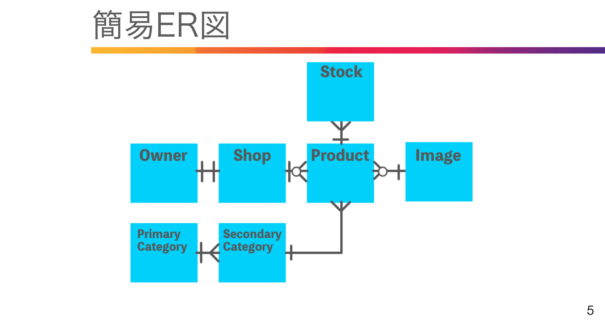

# 73. Shop作成 その１(トランザクション・例外・エラー)


### 目的：　Shopを作成したい
一人のオーナーが一つのショップを持つ  
オーナー登録した際、同時にショップを作る仕様  
オーナーを登録するのは管理者側
->管理者側でオーナーを登録した際にショップも作る  

### Shopの作成
Admin/OwnersControler@storeメソッドでオーナー登録していたので、  
ショップ作成のコードを追記    
外部キー向けにidを取得  
$owner = Owner::create();  
$owner->id;  
Shop::create で作成する場合は  
モデル側に $fillableも必要   

app/Models/Shop.php
```php
namespace App\Models;

use Illuminate\Database\Eloquent\Factories\HasFactory;
use Illuminate\Database\Eloquent\Model;
use App\Models\Owner;

class Shop extends Model
{
    use HasFactory;

    protected $fillable = [
        'owner_id',
        'name',
        'information',
        'filename',
        'is_selling',
    ];
    
    public function owner()
    {
    return $this->belongsTo(Owner::class);
    }
}
```

### トランザクション
複数のテーブルに保存する際は  
トランザクションをかける  
処理の途中でトラブルがあった時にロールバックする仕組み  
無名関数内で親の変数を使うには useが必要  
DB::transaction(function() use ($request){  
DB::create($requst->name);  
DB::create($request->owner_id);  
}, 2) // NG時2回試す  

### 例外 + ログ
トランザクションでエラー時は例外発生  
PHP7 から Throwableで例外を取得してログに表示    
ログは storage/logs 内に保存  
use Throwable;  
use Iluminate\Support\Facades\Log;  
try{  
トランザクション処理  
} catch( Throwable $e ){  
Log::error($e);  
throw $e;  
}  

app/Http/Controllers/Admin/OwnersController.php
```php
use App\Models\Shop; //追加
use Throwable; //追加
use Illuminate\Support\Facades\Log; //追加

public function store(Request $request)
    {
        $request->validate([
            'name' => 'required|string|max:255',
            'email' => 'required|string|email|max:255|unique:owners',
            'password' => 'required|string|confirmed|min:8',
        ]);

        try{} catch( Throwable $e ){
            Log::error($e);  
            throw $e;  
            }  

        Owner::create([
            'name' => $request->name,
            'email' => $request->email,
            'password' => Hash::make($request->password),
        ]);

        return redirect()
        ->route('admin.owners.index')
        ->with(['message' => 'オーナー登録を実施しました。',
        'status' => 'info']);
    }
```
<br>

# 74. Shop作成　その２

### 目的：　try〜catch構文でOwnerとShopを連携、編集画面に店名を追加

データベースのownersに新規登録したタイミングでshopsを作る(idでお互いを紐づける)  
app/Http/Controllers/Admin/OwnersController.php
```php
try{
    DB::transaction(function () use($request) {
        // ownerを作成したタイミングで
        $owner = Owner::create([
            'name' => $request->name,
            'email' => $request->email,
            'password' => Hash::make($request->password),
        ]);
        // owner_idを外部キーとしてshopを作る
        Shop::create([
            'owner_id' => $owner->id,
            'name' => '店名を入力してください',
            'information' => '',
            'filename' => '',
            'is_selling' => true,　// 販売中
        ]);
    }, 2); // 2回繰り返す
} catch( Throwable $e ){
    Log:error($e);  // エラーが出たら
    throw $e;  
    }  
```
<br>

#　75. Shop Delete(カスケード)

### Shopの削除 カスケード
Oenerを削除したタイミングでShopも削除  
Owner->Shop と
外部キー制約を設定しているため
追加設定が必要。

database/migrations/create_shops_table.php
```php
$table->foreignId('owner_id')
->constrained()
->onUpdate('cascade')
->onDelete('cascade');
```
