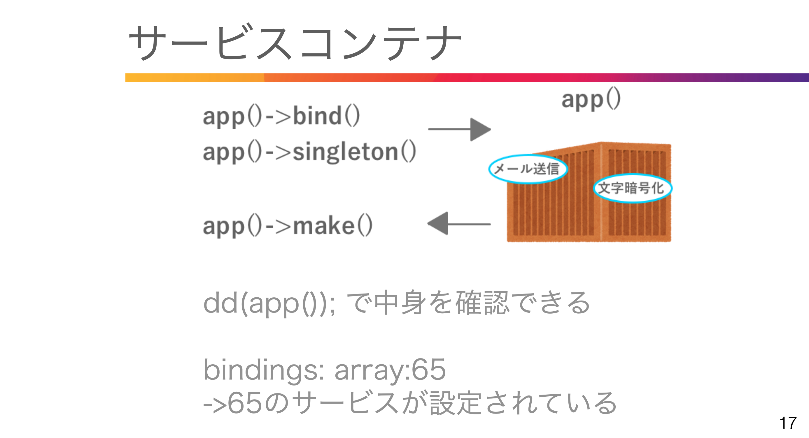
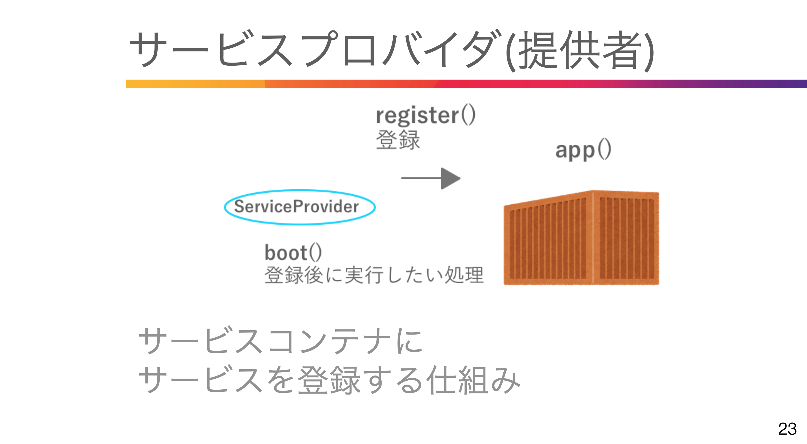

# 32. ライフサイクル

### 全体の流れ
WEBサーバがpublic/index.phpにリダイレクト  
1. autolode読み込み  
2. Applicationインスタンス作成
3. HttpKernelインスタンス作成
4. Requestインスタンス作成
5. HttpKernelがリクエストを作成してResponse取得
6. レスポンス送信
7. terminate()で後片付け

### 1. autolode 読み込み  
public/index.php
```php
require __DIR__.'/../vendor/autoload.php';  
```

### サービスコンテナ(Applicationインスタンス)
```php
$app = require_once __DIR__.'/../bootstrap/app.php';
```
bootstrap/app.php
```php
$app = new Illuminate\Foundation\Application(
    $_ENV['APP_BASE_PATH'] ?? dirname(__DIR__)
);
```

<br>

# 33. サービスコンテナ



route/web.php  
```php
use App\Http\Controllers\LifeCycleTestController;

Route::get('/servicecontainertest', [LifeCycleTestController::class, 'showServiceContainerTest']);
```
php artisan make:controller LifeCycleTestController

app/Http/Controllers/LifeCycleTestController.php

```php
<?php

namespace App\Http\Controllers;

use Illuminate\Http\Request;

class LifeCycleTestController extends Controller
{
    public function showServiceContainerTest()
    {
        dd(app());
    }
}
```

### サービスコンテナに登録する
```php
//引数(取り出す時の名前、機能)  
//Bindings:の数が65->66に増えている
app()->bind('lifeCycleTest', function(){  
    return 'ライフサイクルテスト';  
});

$test = app()->make('lifeCycleTest');
dd($test, app());
```

<br>

# 34. サービスコンテナ その２

### 依存関係の解決

```php

class LifeCycleTestController extends Controller
{
    public function showServiceContainerTest()
    {
        app()->bind('lifeCycleTest', function(){  
        return 'ライフサイクルテスト';  
        });

        $test = app()->make('lifeCycleTest');

        // サービスコンテナなしのパターン
        // 依存した2つのクラスはそれぞれインスタンス化後に実行するが、   
        $message = new Message();
        $sample = new Sample($message);
        $sample->run();
        dd($test, app());
    }
}

class Sample
{
    public $message;
    public function __construct(Message $message){
        $this->message = $message;
    }
    public function run(){
        $this->message->send();
    }
}

// メッセージを表示するだけのクラス
class Message
{
    public function send(){
        echo('メッセージ表示');
    }
}
```

```php
//サービスコンテナを使ったパターン  
app()->bind('sample', Sample::class);  
$sample = app()->make('sample');  
$sample->run(); 
```

<br>

# 36. サービスプロバイダ その１



### サービスプロバイダの読み込み箇所
```php
illminate\Foundation\Application  

registerConfiguredProviders(){
    $providers = Collection::make($this->config['app.providers'];)
}
```

routes/web.php
```php
Route::get('/serviceprovidertest', [LifeCycleTestController::class, 'showServiceProviderTest']);
```

app/Http/Controllers/LifeCycleTestController.php
```php
class LifeCycleTestController extends Controller
{
    public function showServiceProviderTest()
    {
        $encrypt = app()->make('encrypter');
        $password = $encrypt->encrypt('password');
        dd($password, $encrypt->decrypt($password));
    }
```

<br>

# 37. サービスプロバイダ その２

php artisan make:provider SampleServiceProvider

app/Providers/SampleServiceProvider.php
```php
class SampleServiceProvider extends ServiceProvider
{
    public function register(): void
    {
        app()->bind('serviceProviderTest', function(){
            return 'サービスプロバイダのテスト';
        });
    }
```

config/app.php
```php
'providers' => ServiceProvider::defaultProviders()->merge([
        App\Providers\AppServiceProvider::class,
        App\Providers\AuthServiceProvider::class,
        App\Providers\EventServiceProvider::class,
        App\Providers\RouteServiceProvider::class,
        
        App\Providers\SampleServiceProvider::class,
```

app/Http/Controllers/LifeCycleTestController.php
```php
class LifeCycleTestController extends Controller
{
    public function showServiceProviderTest()
    {
        $encrypt = app()->make('encrypter');
        $password = $encrypt->encrypt('password');
        $sample = app()->make('serviceProviderTest');

        dd($sample, $password, $encrypt->decrypt($password));
    }
```