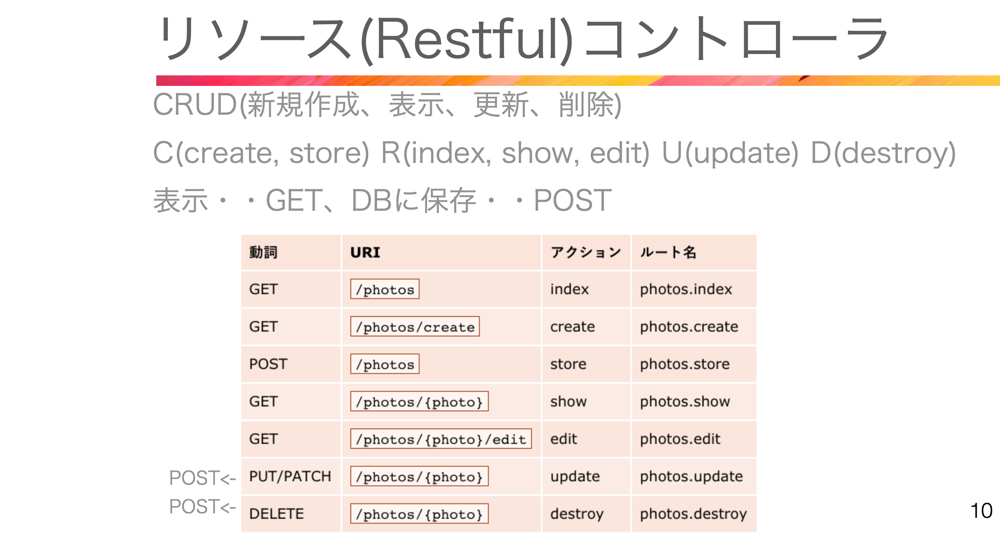

# 64. ソフトデリート View側
# 65. ソフトデリート 処理



論理削除(ソフトデリート)->復元できる(ゴミ箱)  
物理削除(デリート)->復元できない  

database/migrations/create_owners_table.php  
```php
$table->softDeletes();
```
app/Models/Owner.php
```php
use Illuminate\Database\Eloquent\SoftDeletes;

class Owner extends Authenticatable
{
    // SoftDeletes追加
    use HasFactory, SoftDeletes;
    protected $fillable = [
        'name',
        'email',
        'password',
    ];
}
```

App/Controllers/Admin/OwnerController.php
'status' => 'info'追加  
```php
public function store(Request $request)
    {
        $request->validate([
            'name' => 'required|string|max:255',
            'email' => 'required|string|email|max:255|unique:owners',
            'password' => 'required|string|confirmed|min:8',
        ]);

        Owner::create([
            'name' => $request->name,
            'email' => $request->email,
            'password' => Hash::make($request->password),
        ]);

        return redirect()
        ->route('admin.owners.index')
        ->with(['message' => 'オーナー登録を実施しました。',
        'status' => 'info']);
    }

public function update(Request $request, $id)
{
    $owner = Owner::findOrFail($id);
    $owner->name = $request->name;
    $owner->email = $request->email;
    $owner->password = Hash::make($request->password);
    $owner->save();

    return redirect()
    ->route('admin.owners.index')
    ->with(['message' => 'オーナー情報を更新しました。',
    'status' => 'info']);
}

public function destroy(string $id)
{
    // dd('削除処理');
    Owner::findOrFail($id)->delete(); //ソフトデリート

    return redirect()
    ->route('admin.owners.index')
    ->with(['message' => 'オーナー情報を削除しました。',
    'status' => 'alert']);
}
```
resources/views/components/flash-message.blade.php
session('status')に変更  
```php
@props(['status' => 'info'])

@php
if(session('status') === 'info'){$bgColor = 'bg-blue-300';}
if(session('status') === 'alert'){$bgColor = 'bg-red-500';}
@endphp

@if(session('message'))
  <div class="{{ $bgColor }} w-1/2 mx-auto p-2 text-white">
    {{ session('message' )}}
  </div>
@endif
```

resources/views/admin/owners/index.blade.php
```php
<form id="delete_{{$owner->id}}" method="post" action="{{ route('admin.owners.destroy', ['owner' => $owner->id ] )}}">
    @csrf
    @method('delete')
    <td class="px-4 py-3">
    <a href="#" data-id="{{ $owner->id }}" onclick="deletePost(this)" 
    class="text-white bg-red-400 border-0 py-2 px-4 focus:outline-none hover:bg-red-500 rounded ">削除</a>                        
    </td>
</form>

<script>
  function deletePost(e) {
      'use strict';
      if (confirm('本当に削除してもいいですか?')) {
      document.getElementById('delete_' + e.dataset.id).submit();
      }
  }
  </script>
```